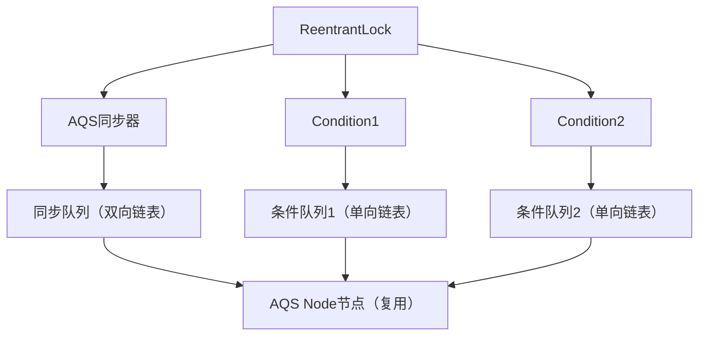

### 一、AQS (AbstractQueuedSynchronizer) 抽象队列同步器

#### 核心原理

AQS 核心设计围绕**状态管理**和**队列调度**两大模块，采用**模板方法模式**封装通用流程，子类实现具体业务逻辑。

#### 1. 核心组件

| 组件      | 类型                  | 作用                                               |
| ------- | ------------------- | ------------------------------------------------ |
| state   | volatile int        | 同步状态变量，0 表示无资源 / 未锁定，>0 表示有资源 / 已锁定（重入时递增）       |
| 同步队列    | FIFO 双向链表（CLH 队列变体） | 存储获取同步状态失败的线程节点，实现线程排队与唤醒                        |
| Node 节点 | 内部类                 | 封装等待线程、等待状态、前后指针等信息，是同步队列的基本单元                   |
| 条件队列    | 多个单向链表              | 支持线程条件等待（如 Condition），类似 Object 的 wait/notify 机制 |

#### 2.  同步队列（CLH 队列）

*   结构：**双向链表**，头节点（head）为获取锁成功的线程，尾节点（tail）为新加入的等待线程
*   入队：线程获取锁失败时，封装为 Node 节点，通过 CAS 原子操作加入队尾，保证线程安全
*   出队：头节点线程释放锁时，唤醒后继节点，后继节点尝试获取锁，遵循**FIFO 先进先出**原则

#### 3. Node 节点核心属性

    static final class Node {
        static final int CANCELLED =  1; // 线程取消等待
        static final int SIGNAL    = -1; // 后继线程需要唤醒
        static final int CONDITION = -2; // 线程在条件队列等待
        static final int PROPAGATE = -3; // 共享模式下唤醒后继节点
        volatile int waitStatus; // 等待状态
        volatile Node prev; // 前驱节点
        volatile Node next; // 后继节点
        Thread thread; // 等待的线程
        Node nextWaiter; // 条件队列后继节点
    }

#### 4. 工作模式：独占模式和共享模式

**(1) 独占模式(Exclusive Mode)**

*   **核心特性**：同一时刻仅允许一个线程获取同步状态（state），其他线程必须阻塞等待
*   **形象比喻**：像单人卫生间，一次只能一个人使用，其他人排队等候
*   **状态含义**：state 通常表示锁的持有 / 重入次数，0 表示未被持有，>0 表示被某线程持有（重入时递增）
*   **核心方法**：tryAcquire ()/tryRelease ()（返回 boolean）
*   **典型应用**：ReentrantLock、ReentrantReadWriteLock.WriteLock

**(2) 共享模式（Shared Mode）**

*   **核心特性**：同一时刻允许多个线程同时获取同步状态，线程间非互斥
*   **形象比喻**：像公园长椅，可同时容纳多人，只要有位置就能坐下
*   **状态含义**：state 通常表示可用资源数量（如 Semaphore 的许可数、CountDownLatch 的计数），≥0 表示有可用资源
*   **核心方法**：tryAcquireShared ()/tryReleaseShared ()（返回 int）
*   **典型应用**：Semaphore、CountDownLatch、ReentrantReadWriteLock.ReadLock

#### 5. 核心运行流程

**(1) 独占模式**

**获取锁(acquire)**

1. 调用 tryAcquire(int arg) 尝试获取锁（子类实现，如 ReentrantLock 的公平 / 非公平逻辑）
2. 成功(0 -> 1)：直接返回，线程继续执行
3. 失败：将线程封装为 Node 独占节点加入 CLH 队列尾部
4. 线程在队列中阻塞（通过 LockSupport.park ()），直到被前驱节点唤醒
5. 被唤醒后重新尝试获取锁，成功则设置为头节点并继续执行

**释放资源(release)**

1. 调用 tryRelease(int arg) 尝试释放资源（子类实现）
2. 成功(1/n -> 0，重入需减到 0)：唤醒队列中第一个等待的后继节点
3. 失败：返回 false，不进行唤醒操作

**(2) 共享模式**

**获取资源(acquireShared)**

1.  调用 tryAcquireShared(int arg) 尝试获取资源（返回值有特殊含义）, state 减1后：
    *   负数：获取失败
    *   0：获取成功，但无剩余资源（不唤醒后续节点）
    *   正数：获取成功，且有剩余资源（会唤醒后续节点）
2.  成功：直接返回，线程继续执行
3.  失败：将线程封装为 Node 共享节点加入 CLH 队列尾部
4.  线程在队列中阻塞，直到被前驱节点唤醒并重新尝试获取
    **释放资源(releaseShared)**
5.  调用 tryReleaseShared(int arg) 尝试释放资源（子类实现）,state 加 1
6.  成功：可能触发传播唤醒，唤醒多个等待的共享节点
7.  失败：返回 false，不进行唤醒操作

#### 6. 设计模式与关键机制

*   **模板方法模式**：AQS 定义获取 / 释放锁的通用流程（如 acquire、release），子类实现 tryAcquire、tryRelease 等方法，保证流程统一、逻辑解耦
*   **volatile 保证可见性**：state 用 volatile 修饰，确保线程间状态修改实时可见
*   **CAS 保证原子性**：入队、修改 state 等操作依赖 CAS 实现无锁并发，提升性能
*   **自旋 + 阻塞**：线程入队前短暂自旋，避免频繁上下文切换，提高效率

### 二、CountDownLatch 倒计时门闩

#### 介绍

让**一个或多个线程**等待其他线程完成一系列操作后，再继续执行。核心是「计数器递减」：初始化时指定计数器值，线程完成任务后调用 countDown() 减 1，调用 await() 的线程会阻塞，直到计数器归 0（**一次性使用，计数器归 0 后无法重置**）。

#### 原理

*   基于 AQS 实现，AQS 的 state 变量存储计数器值（共享模式）
*   countDown()：通过 CAS 将 state 减 1，若 state 变为 0，唤醒所有等待的线程；
*   void await()：若 state > 0，当前线程加入 AQS 等待队列并阻塞，直到 state = 0 被唤醒。
*   boolean await(long timeout, TimeUnit unit)，限时等待，超时后自动唤醒。返回 true：计数器在超时前归零；返回 false：超时且计数器未归零；

#### 使用场景

*   主线程等待多个子线程初始化完成（如项目启动时，等待配置加载、数据库连接初始化等）；
*   批量任务执行后汇总结果（如多线程爬取数据，等待所有爬虫线程完成后汇总数据）。

#### 代码案例
```java
import java.util.concurrent.CountDownLatch;

public class CountDownLatchDemo {
    // 初始化计数器，值为5（表示需要等待5个线程完成）
    private static final CountDownLatch latch = new CountDownLatch(5);

    public static void main(String[] args) throws InterruptedException {
        // 启动5个初始化线程
        for (int i = 0; i < 5; i++) {
            int finalI = i;
            new Thread(() -> {
                try {
                    System.out.println("线程" + finalI + "：执行初始化任务（如加载配置）");
                    Thread.sleep(1000); // 模拟任务耗时
                } catch (InterruptedException e) {
                    e.printStackTrace();
                } finally {
                    // 任务完成，计数器减1
                    latch.countDown();
                    System.out.println("线程" + finalI + "：任务完成，当前计数器值=" + latch.getCount());
                }
            }).start();
        }

        // 主线程等待所有初始化线程完成
        System.out.println("主线程：等待所有初始化线程完成...");
        latch.await(); // 阻塞直到计数器归0
        System.out.println("主线程：所有初始化线程完成，开始执行核心业务！");
    }
}
```

输出效果：

    主线程：等待所有初始化线程完成...
    线程0：执行初始化任务（如加载配置）
    线程1：执行初始化任务（如加载配置）
    线程2：执行初始化任务（如加载配置）
    线程3：执行初始化任务（如加载配置）
    线程4：执行初始化任务（如加载配置）
    线程0：任务完成，当前计数器值=4
    线程1：任务完成，当前计数器值=3
    线程2：任务完成，当前计数器值=2
    线程3：任务完成，当前计数器值=1
    线程4：任务完成，当前计数器值=0
    主线程：所有初始化线程完成，开始执行核心业务！

### 三、ReentrantLock 可重入锁

ReentrantLock（可重入锁）是 Java 并发包 java.util.concurrent.locks 下的核心独占锁实现，基于 AQS（AbstractQueuedSynchronizer）实现，是 synchronized 关键字的灵活替代方案，支持可重入、公平 / 非公平模式、可中断等待、超时获取锁等特性。

#### 核心原理

**1. 基础特性：可重入**
“可重入” 指**同一个线程**可以多次获取同一把锁，不会自己阻塞自己(比如递归、多个方法公用一个锁，避免阻塞自己)。ReentrantLock 通过 AQS 的 state 变量实现重入：

*   state = 0：锁未被任何线程持有；
*   线程首次获取锁：state 从 0 变为 1；
*   同一线程再次获取锁：state 自增（如重入 3 次则 state = 3）；
*   线程释放锁：state 自减，直到 state = 0 时锁完全释放。

**2. 公平 / 非公平模式（核心差异）**
ReentrantLock 支持两种获取锁的模式，通过构造器指定（默认非公平）：

    // 非公平锁（默认）：性能更高，可能出现“插队”
    ReentrantLock lock = new ReentrantLock();
    // 公平锁：按CLH队列顺序获取锁，性能稍低但无饥饿
    ReentrantLock fairLock = new ReentrantLock(true);

| 特性   | 非公平锁（默认）            | 公平锁          |
| ---- | ------------------- | ------------ |
| 获取逻辑 | 先尝试 CAS 抢锁，失败再入队    | 直接入队，按队列顺序获取 |
| 性能   | 高（减少上下文切换）          | 低（严格排队）      |
| 核心风险 | 可能 “饥饿”（某些线程长期抢不到锁） | 无饥饿          |
| 适用场景 | 大部分业务场景（追求性能）       | 需严格按顺序执行的场景  |

**3. 底层实现（基于 AQS 独占模式）**
ReentrantLock 内部封装了一个继承 AQS 的 Sync 抽象类，又分为 NonfairSync（非公平）和 FairSync（公平）两个子类，核心流程如下：

(1) 获取锁（lock()）

    A[线程调用lock()] --> B{是否非公平锁？};
    B -->|是| C[尝试CAS将state从0改为1];
    C -->|成功| D[获取锁，设置独占线程为当前线程];
    C -->|失败| E[调用AQS的acquire(1)入队等待];
    B -->|否| F[直接调用acquire(1)入队等待];
    E --> G[CLH队列中阻塞，被唤醒后重试获取锁];
    F --> G;
    G -->|成功| D;

(2)释放锁（unlock()）

    A[线程调用unlock()] --> B[调用AQS的release(1)];
    B --> C[state自减1];
    C --> D{state是否为0？};
    D -->|是| E[释放锁，唤醒CLH队列后继节点];
    D -->|否| F[锁未完全释放，仅减少重入次数];

#### 代码案例

**1. 多条件变量（Condition）**

    import java.util.LinkedList;
    import java.util.Queue;
    import java.util.concurrent.locks.Condition;
    import java.util.concurrent.locks.ReentrantLock;

    /**
     * 生产者-消费者模型：ReentrantLock + Condition 实现精准唤醒
     */
    public class ReentrantLockConditionDemo {
        private static final ReentrantLock lock = new ReentrantLock();
        // 空队列条件：消费者等待
        private static final Condition emptyCondition = lock.newCondition();
        // 满队列条件：生产者等待
        private static final Condition fullCondition = lock.newCondition();
        private static final Queue<String> queue = new LinkedList<>();
        private static final int CAPACITY = 5; // 队列容量

        // 生产者
        private static class Producer implements Runnable {
            @Override
            public void run() {
                while (true) {
                    lock.lock();
                    try {
                        // 队列满则等待
                        while (queue.size() == CAPACITY) {
                            System.out.println("队列满，生产者等待");
                            fullCondition.await(); // 释放锁，等待被唤醒
                        }
                        // 生产数据
                        String data = "数据-" + System.currentTimeMillis();
                        queue.offer(data);
                        System.out.println("生产者生产：" + data + "，队列大小：" + queue.size());
                        // 唤醒消费者（精准）
                        emptyCondition.signal();
                        Thread.sleep(500);
                    } catch (InterruptedException e) {
                        e.printStackTrace();
                    } finally {
                        lock.unlock();
                    }
                }
            }
        }

        // 消费者
        private static class Consumer implements Runnable {
            @Override
            public void run() {
                while (true) {
                    lock.lock();
                    try {
                        // 队列空则等待
                        while (queue.isEmpty()) {
                            System.out.println("队列空，消费者等待");
                            emptyCondition.await();
                        }
                        // 消费数据
                        String data = queue.poll();
                        System.out.println("消费者消费：" + data + "，队列大小：" + queue.size());
                        // 唤醒生产者（精准）
                        fullCondition.signal();
                        Thread.sleep(1000);
                    } catch (InterruptedException e) {
                        e.printStackTrace();
                    } finally {
                        lock.unlock();
                    }
                }
            }
        }

        public static void main(String[] args) {
            new Thread(new Producer()).start();
            new Thread(new Consumer()).start();
        }
    }

执行结果（核心片段）：

    # 默认 非公平，CAS 抢锁
    生产者生产：数据-1710234567890，队列大小：1 # 生产者竞争到锁
    消费者消费：数据-1710234567890，队列大小：0 # 消费者竞争到锁
    队列空，消费者等待 # 释放锁，加入条件队列并阻塞
    # 获取锁后，唤醒消费条件，转移到同步队列，参与锁竞争
    生产者生产：数据-1710234568391，队列大小：1 
    生产者生产：数据-1710234568892，队列大小：2 # 生产者竞争到锁
    消费者消费：数据-1710234568391，队列大小：1 # 消费者竞争到锁

### 四、Condition（条件变量）

Condition 是 Java 并发包中配合 Lock（如 ReentrantLock）使用的条件变量，是 Object 类中 wait()/notify()/notifyAll() 方法的升级版，由 AQS（AbstractQueuedSynchronizer）提供底层支持，用于实现 “线程等待某个条件满足后再被唤醒” 的逻辑。

核心特点：

*   每个 Lock 可以创建多个 Condition（多条件队列），解决了 Object 只能有一个等待队列的局限性；
*   支持更灵活的等待策略（可中断等待、超时等待、无期限等待）；
*   必须在持有锁的前提下使用（和 wait() 需持有对象监视器锁同理）。

#### 核心原理

Condition 的实现依赖 AQS 的两个核心队列：同步队列（AQS 本身的 CLH 队列，存储等待获取锁的线程）和条件队列（Condition 独有的单向链表，存储等待条件满足的线程），两个队列复用 AQS 的 Node 节点（通过 waitStatus 区分状态：CONDITION = -2 表示节点在条件队列）。
**1. 核心组件关系**



**2. 条件队列的结构**

*   条件队列是单向链表（区别于同步队列的双向链表），每个 Condition 对应一个独立的条件队列；
*   节点的 waitStatus 标记为 CONDITION (-2)，表示该线程在等待条件满足；
*   节点的 nextWaiter 字段作为单向链表的后继指针（同步队列用 prev/next）。
    **3. 核心方法执行流程**
    Condition 的核心逻辑围绕 await()（等待条件）和 signal()/signalAll()（唤醒等待线程）展开，以下是详细流程：

（1）await () 方法（线程等待条件）

线程调用 condition.await() 时，需先持有 Lock 对应的锁（即已获取 AQS 的 state），执行步骤：

1. **释放锁**：调用 AQS 的 release() 方法释放锁（将 state 置为 0，唤醒同步队列后继节点）；
2. **加入条件队列**：将当前线程封装为 Node（waitStatus=CONDITION），加入 Condition 的条件队列队尾；
3. **阻塞线程**：挂起当前线程，等待被唤醒；
4. **被唤醒后重新竞争锁**：线程被 signal() 唤醒后，会从条件队列转移到同步队列，然后参与锁的竞争，竞争成功后 await() 方法才会返回。

（2）signal () 方法（唤醒单个等待线程）

线程调用 condition.signal() 时，需先持有 Lock 对应的锁，执行步骤：

1. **转移节点**：将条件队列的头节点移除，转移到 AQS 的同步队列队尾；
2. **修改节点状态**：将节点的 waitStatus 从 CONDITION 改为 0（或 SIGNAL），标记为需唤醒；
3. **唤醒线程**：若节点状态正常，唤醒该线程，线程会尝试竞争同步队列的锁。

（3）signalAll () 方法（唤醒所有等待线程）

和 signal() 逻辑一致，区别是将条件队列中所有节点转移到同步队列并唤醒，而非仅头节点。

**4. 完整生命周期示例（生产者 - 消费者）**

```

    A[线程1持有锁] --> B[调用await()：释放锁+加入条件队列]
    B --> C[线程1阻塞]
    D[线程2持有锁] --> E[调用signal()：转移线程1到同步队列]
    E --> F[线程1唤醒，竞争同步队列锁]
    F --> G[线程1获取锁，await()返回，继续执行]
```

### 五、CyclicBarrier（循环栅栏）

#### 介绍

让**一组线程互相等待**，全部到达屏障点后同时继续执行。每个线程调用 await()，内部 count 减 1，count 归 0 时唤醒所有线程（**可重复使用，计数器自动重置**，区别于 CountDownLatch 的一次性）。

#### 原理

- 基于 **ReentrantLock + Condition** 实现（**不是 AQS 共享模式**，注意与 CountDownLatch 区分）
- 内部维护 `count` 计数器（初始值 = parties），每次 `await()` 将 count 减 1
- count 归 0 时：先执行可选的 `barrierAction` 回调，再 signalAll() 唤醒所有线程，重置 count

**await() 核心流程**：
1. 加 ReentrantLock 锁
2. count 减 1
3. 若 count > 0 → 当前线程在 Condition 上等待（释放锁）
4. 若 count = 0 → 执行 barrierAction（如有），signalAll() 唤醒所有线程，重置 count = parties

#### CountDownLatch vs CyclicBarrier 对比

| 维度 | CountDownLatch | CyclicBarrier |
|------|---------------|---------------|
| 计数方向 | 倒数到 0 | 内部递减到 0 |
| 可重用 | 否（一次性） | 是（自动重置） |
| 等待方 | 主线程等子线程完成 | 所有参与线程互相等待 |
| 底层实现 | AQS 共享模式 | ReentrantLock + Condition |
| 回调 | 无 | 支持 barrierAction |
| 异常处理 | 无特殊机制 | 一个线程异常/超时 → 其他线程收到 BrokenBarrierException |

#### 代码案例

```java
import java.util.concurrent.CyclicBarrier;

public class CyclicBarrierDemo {
    // 3个线程分阶段计算，每阶段结束后汇总
    private static final CyclicBarrier barrier = new CyclicBarrier(3, () -> {
        System.out.println(">>> 所有线程已到达屏障，开始汇总结果");
    });

    public static void main(String[] args) {
        for (int i = 0; i < 3; i++) {
            int threadId = i;
            new Thread(() -> {
                try {
                    System.out.println("线程" + threadId + "：完成第一阶段计算");
                    barrier.await(); // 等待其他线程

                    // 栅栏可重用，继续第二阶段
                    System.out.println("线程" + threadId + "：完成第二阶段计算");
                    barrier.await();

                    System.out.println("线程" + threadId + "：全部阶段完成");
                } catch (Exception e) {
                    e.printStackTrace();
                }
            }).start();
        }
    }
}
```

#### 高频追问

1. **barrierAction 由哪个线程执行？** 最后一个到达屏障的线程执行
2. **某个线程 await() 时被中断会怎样？** 该线程抛 InterruptedException，其他等待线程抛 BrokenBarrierException，栅栏进入 broken 状态
3. **broken 状态能恢复吗？** 需调用 reset() 重置，但仍在等待的线程会收到 BrokenBarrierException
4. **CyclicBarrier 能替代 CountDownLatch 吗？** 功能上可以，但语义不同：CountDownLatch 适合「一等多」，CyclicBarrier 适合「多等多」

### 六、Semaphore（信号量）

#### 介绍

控制**同时访问特定资源的线程数量**，核心是「许可证机制」：初始化指定许可数，线程通过 acquire() 获取许可（许可数减 1），通过 release() 释放许可（许可数加 1），许可数为 0 时后续线程阻塞等待。

#### 原理

- 基于 **AQS 共享模式**实现，AQS 的 state = **剩余许可数**
- `acquire()`：CAS 将 state 减 1，若 state < 0 则加入 AQS 等待队列阻塞
- `release()`：CAS 将 state 加 1，唤醒等待队列中的线程
- 支持**公平模式**（按队列顺序）和**非公平模式**（默认，新线程可插队）

```java
Semaphore fairSem = new Semaphore(3, true);   // 公平模式
Semaphore unfairSem = new Semaphore(3);       // 非公平模式（默认）
```

#### 代码案例

```java
import java.util.concurrent.Semaphore;

/**
 * 模拟停车场限流：最多 3 辆车同时停放
 */
public class SemaphoreDemo {
    private static final Semaphore parkingLot = new Semaphore(3);

    public static void main(String[] args) {
        for (int i = 1; i <= 6; i++) {
            int carId = i;
            new Thread(() -> {
                try {
                    System.out.println("车辆" + carId + "：等待进入停车场...");
                    parkingLot.acquire();
                    System.out.println("车辆" + carId + "：进入停车场（剩余车位："
                                       + parkingLot.availablePermits() + "）");
                    Thread.sleep(2000); // 模拟停车
                } catch (InterruptedException e) {
                    e.printStackTrace();
                } finally {
                    parkingLot.release();
                    System.out.println("车辆" + carId + "：离开停车场");
                }
            }).start();
        }
    }
}
```

#### 使用场景

- **限流**：控制接口/资源的并发访问量（如数据库连接池）
- **资源池**：固定大小的资源池（停车场、打印机）
- **流量控制**：限制对外部服务的并发调用数

#### 高频追问

1. **许可数可以动态增减吗？** 可以，release() 可不与 acquire() 配对，多次 release 会增加许可总数
2. **Semaphore 能实现互斥锁吗？** 可以，new Semaphore(1) 就是互斥锁，但不支持重入
3. **acquire() 和 tryAcquire() 区别？** acquire() 获取不到时阻塞；tryAcquire() 立即返回 boolean 不阻塞，支持超时版本
4. **Semaphore 和线程池的区别？** 线程池控制线程数量，Semaphore 控制并发访问资源的线程数（线程已存在）

### 七、ReentrantReadWriteLock（读写锁）

#### 介绍

实现 **ReadWriteLock** 接口，内部维护一对锁：**读锁（共享）** 和 **写锁（独占）**。核心思想：「读读共享、读写互斥、写写互斥」，适用于**读多写少**场景，相比 ReentrantLock 的完全互斥能显著提升读并发性能。

#### 核心原理

**1. state 变量的位运算设计**

```
state（32 位 int）
┌──────────────────┬──────────────────┐
│    高 16 位        │    低 16 位        │
│   读锁持有次数      │   写锁重入次数      │
└──────────────────┴──────────────────┘
```
- 读锁计数：`state >>> 16`
- 写锁计数：`state & 0x0000FFFF`
- 最大重入/持有次数：2^16 - 1 = 65535

**2. 互斥规则**

| 当前锁状态 | 读锁请求 | 写锁请求 |
|-----------|---------|---------|
| 无锁 | 允许 | 允许 |
| 持有读锁 | **允许**（共享） | **阻塞** |
| 持有写锁 | **阻塞** | 同一线程可重入，其他线程阻塞 |

**3. 锁降级（写锁 → 读锁）**

```
锁降级（支持）：获取写锁 → 获取读锁 → 释放写锁 → 持有读锁继续读
锁升级（不支持！）：获取读锁 → 获取写锁 → 死锁！
```

- **为什么支持降级？** 写完数据后降级为读锁，既能读自己刚写的数据，又允许其他线程并发读
- **为什么不支持升级？** 多线程同时持有读锁并尝试升级写锁，互相等待释放读锁 → 死锁

#### 代码案例

```java
import java.util.HashMap;
import java.util.Map;
import java.util.concurrent.locks.ReentrantReadWriteLock;

/**
 * 基于读写锁实现缓存
 */
public class ReadWriteLockCache<K, V> {
    private final Map<K, V> cache = new HashMap<>();
    private final ReentrantReadWriteLock rwLock = new ReentrantReadWriteLock();
    private final ReentrantReadWriteLock.ReadLock readLock = rwLock.readLock();
    private final ReentrantReadWriteLock.WriteLock writeLock = rwLock.writeLock();

    // 读操作：加读锁（多线程可并发读）
    public V get(K key) {
        readLock.lock();
        try {
            return cache.get(key);
        } finally {
            readLock.unlock();
        }
    }

    // 写操作：加写锁（独占）+ 锁降级
    public V put(K key, V value) {
        writeLock.lock();
        try {
            V old = cache.put(key, value);
            readLock.lock(); // 锁降级：释放写锁前先获取读锁
            return old;
        } finally {
            writeLock.unlock(); // 释放写锁，仍持有读锁
            try {
                System.out.println("写入完成，缓存大小：" + cache.size());
            } finally {
                readLock.unlock();
            }
        }
    }
}
```

#### StampedLock 对比（JDK 8）

| 维度 | ReentrantReadWriteLock | StampedLock |
|------|----------------------|-------------|
| 乐观读 | 不支持 | **支持**（tryOptimisticRead 无锁读） |
| 可重入 | 是 | **否** |
| Condition | 支持 | **不支持** |
| 写饥饿 | 可能（读锁太多，写锁获取不到） | 通过乐观读缓解 |
| 适用场景 | 通用读多写少 | 读远多于写 + 极致性能 |

```java
// StampedLock 乐观读示例
StampedLock sl = new StampedLock();
long stamp = sl.tryOptimisticRead();  // 不加锁
// 读取共享变量...
if (!sl.validate(stamp)) {            // 检查读期间是否有写
    stamp = sl.readLock();            // 升级为悲观读锁
    try { /* 重新读取 */ } finally { sl.unlockRead(stamp); }
}
```

#### 高频追问

1. **读写锁适合什么场景？** 读多写少（缓存、配置）。读写比例接近时，开销反而比 ReentrantLock 大
2. **为什么可能出现写饥饿？** 读锁共享，大量读线程持续获取读锁，写线程一直无法获取。解决：公平模式 `new ReentrantReadWriteLock(true)`
3. **锁降级的实际用途？** 先更新缓存（写锁），降级为读锁继续使用数据，让其他读线程并发访问
4. **StampedLock 能替代 ReentrantReadWriteLock 吗？** 不完全能，StampedLock 不可重入、不支持 Condition，使用不当容易出 bug
